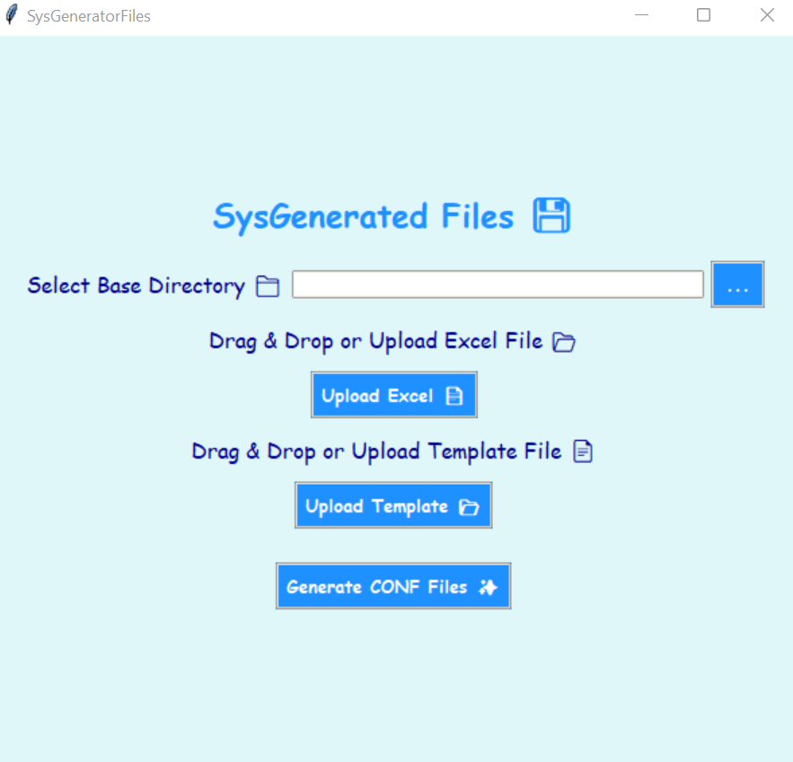

# SysGeneratedFiles

## Overview

SysGeneratedFiles is a Python-based GUI application that automates the generation of configuration (`.conf`) files based on data from an Excel sheet and a template file. This tool simplifies the process by allowing users to manually upload their Excel and template files, then generate configuration files with a single click.

## Problem Statement

Manually creating configuration files is time-consuming, error-prone, and inefficient. Each file needs to be edited individually, leading to delays and inconsistencies. requiring additional effort to correct errors

## Solution

SysGeneratedFiles automates the process of generating configuration files, significantly reducing manual effort. By utilizing an Excel sheet containing device details and a predefined template, the tool creates multiple `.conf` files within seconds. This not only saves time but also ensures accuracy and consistency across all generated files.

## How It Helps 

- **Time-Saving**: Automates repetitive tasks, allowing engineers to focus on more critical work.
- **Standardization**: Ensures all generated files follow the same structure, reducing inconsistencies.

## Features

- Drag & Drop support for Excel and template files
- Multi-threaded file generation for improved performance
- User-friendly GUI built with Tkinter
- Automatic folder creation and file writing
- Error handling and success notifications

## Tools & Technologies Used

- **Python 3.x**: Core programming language
- **Tkinter**: GUI development
- **tkinterdnd2**: Drag & drop file support
- **pandas**: Handling Excel file data
- **openpyxl**: Reading and processing Excel files
- **ThreadPoolExecutor**: Multi-threaded processing for faster execution
- **os & re modules**: File handling and text replacement

## Requirements

Ensure you have the following installed:

- Python 3.x
- Required Python packages:
  ```bash
  pip install tkinterdnd2 pandas openpyxl
  ```


## How It Works

1. Drag and drop or upload an Excel file (`.xlsx` or `.xls`) containing `Device` and `Token` columns.
2. Drag and drop or upload a `.conf` template file.
3. Click the "Generate CONF Files" button.
4. The application will create directories based on IP addresses (`192.168.0.<Token>`) and generate `.conf` files with updated values.
5. A success message will confirm the completion of the process.

## Screenshot

   
   

